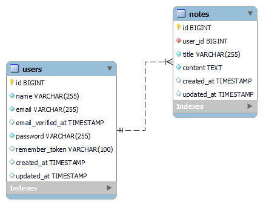
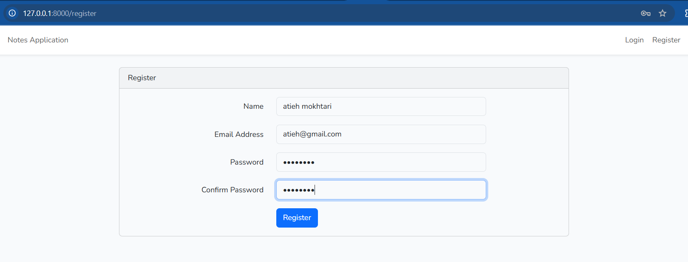
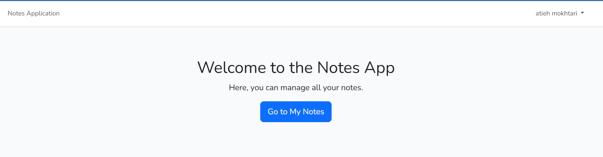
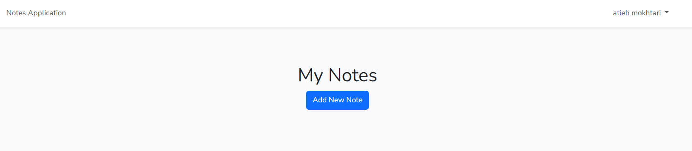
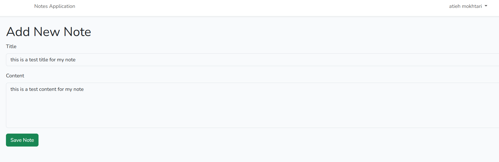
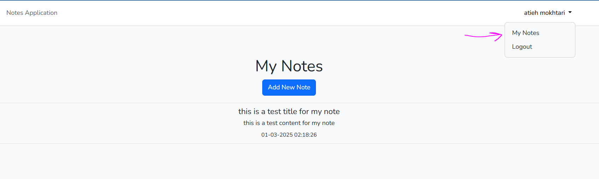
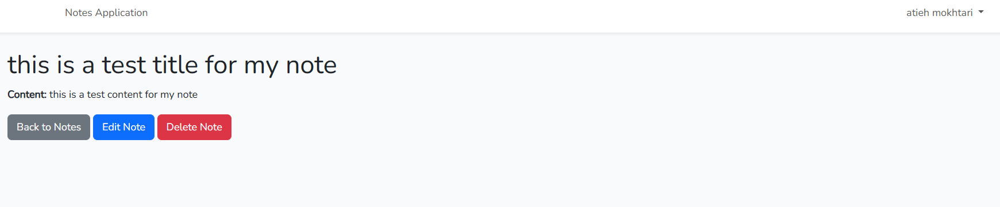
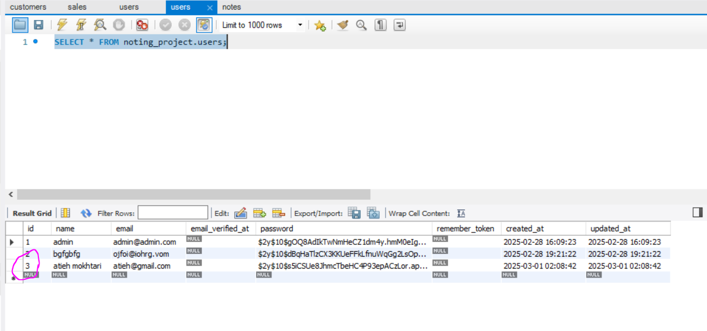
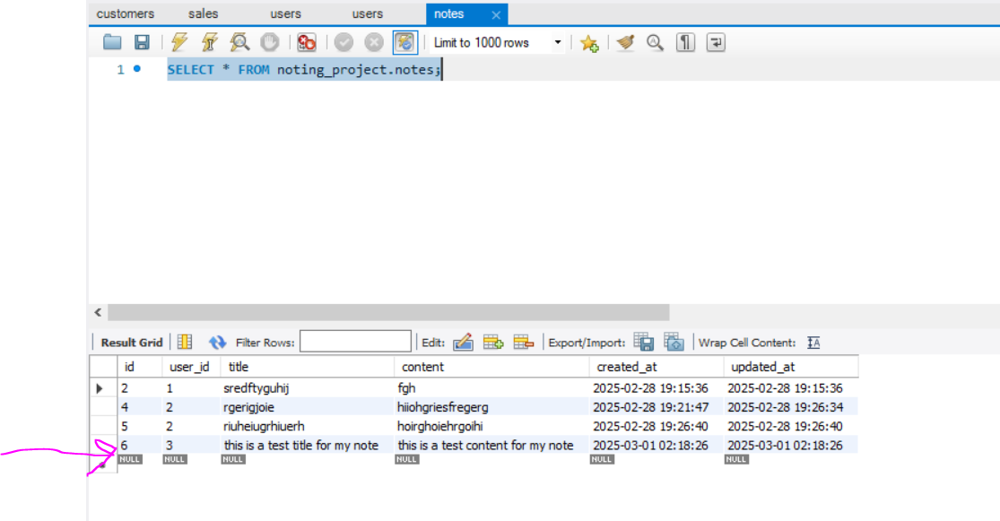

In the name of GOD

Documentation of

**The Noting Project\**

Created and Configured by:

**Atieh Mokhtari**

February 2025

# The Project Goal

The primary objective of this project is to develop a secure and
user-friendly login system using Laravel. The system will allow users to
register an account, log in, and manage their personal notes.

## User Registration & Authentication

-   New users must be able to register with a valid email and password.

-   The system will securely store user credentials and enforce
    authentication best practices.

-   Laravel\'s built-in authentication system is utilized for user login
    and session management.

## Login & Session Management

-   Registered users can log in using their credentials.

-   Sessions will be managed to ensure security and user data
    protection.

-   Unauthorized users cannot access protected pages.

## Notes Management

-   Authenticated users can create, edit, and save personal notes.

-   Each user\'s notes will be private and stored securely in the
    database.

-   Users can view their saved notes only when logged in.

## Access Control & Security

-   Users who are not logged in will not have access to any stored
    notes.

-   Upon logging out, the session will be cleared, ensuring no
    unauthorized access to notes.

This project aims to provide a simple yet effective personal note-taking
system with a focus on user authentication and data privacy.

# Technologies Used

-   Laravel Version: 8.83

-   PHP Version: 7.4

-   Database: MySQL

-   Database Management Tool: MySQL Workbench (for data visualization
    and management)

-   Dependency Management: Composer

-   Frontend Package Management: npm (installed via Composer)

# Database Schema & Relationships

The project utilizes a relational database structure with the following
key relationships:

-   Users Table: Stores user authentication details.

-   Notes Table: Stores user-created notes.

The relationship between these tables follows a One-to-Many (1:N)
structure:

-   Each user can have multiple notes.

-   Each note belongs to only one user.

This ensures that every note entry is linked to a specific user,
maintaining data integrity and privacy.

MySQL is used as the primary database, ensuring efficient data storage
and retrieval. Also MySQL Workbench is used to visualize and manage
stored data.

## Database Diagram

> Here is my database diagram created by workbench; it shows the
> relations between main tables:

{width="4.520833333333333in" height="3.53125in"}

# Project Development Steps

## Setting Up Authentication

-   Installed laravel/ui via Composer to enable authentication control.

-   Configured Laravel authentication scaffolding to manage user login
    and registration.

## Creating the Note Model

-   Added the Note model to represent user notes in the database.

-   Defined the One-to-Many relationship between User and Note models.

## Defining Routes

-   Created routes for handling note-related operations.

-   Ensured that all routes for managing notes are accessible only to
    authenticated users.

## Implementing CRUD Operations

-   Developed Create, Read, Update, and Delete (CRUD) functionalities
    for notes.

-   Enforced authentication checks to restrict unauthorized access.

## Building Views

-   Designed user-friendly views for:

```{=html}
<!-- -->
```
-   Creating a new note

-   Displaying all notes (Index page)

-   Editing & Updating an existing note

-   Deleting a note

## Finalizing User Access Control

-   Ensured that users can only manage their own notes.

-   Restricted all note-related actions to logged-in users.

By following these steps, the system provides a seamless and secure
note-taking experience, ensuring that only authenticated users can
create, view, edit, and delete their personal notes.

# HOW DOES IT WORKS

The project now successfully implements a fully functional
authentication and note management system. The key features include:

## User Registration:

> A new user can register with a valid email and a password (minimum 8
> characters).
>
> User credentials are securely stored in the database.

{width="6.5in" height="2.4791666666666665in"}

## User Login & Home Page:

> A registered user can log in using their credentials. Upon successful
> login, the user is redirected to the homepage of the note-taking
> system.

{width="6.5in" height="1.6979166666666667in"}

## Adding a New Note:

> Users can create a new note by clicking the \"Add New Note\" button. A
> form is displayed where users enter the note details.Once submitted,
> the note is saved in the database.

{width="6.5in" height="1.4236111111111112in"}

{width="6.5in" height="2.125in"}

## Viewing Notes:

> The created note appears on the Notes Page, displaying all saved
> notes. Users can click on any note to view its details.

{width="6.5in" height="1.9444444444444444in"}

## Editing & Deleting Notes:

> By selecting a specific note, users can access options to edit or
> delete it. Edits allow users to update the content, while deletion
> removes the note permanently from the database.

{width="6.5in" height="1.351388888888889in"}

## Database Management:

> User registration details are stored in the users table. All created
> notes are linked to the respective user and stored in the notes table.
> We can see also the details of registered user saving in the users
> table in our database and also the created note is saved in database:

{width="6.5in" height="2.6625in"}

{width="5.871040026246719in"
height="3.059087926509186in"}

# Final Words

This project successfully implements a secure and efficient note
management system using Laravel 8.83, ensuring proper authentication and
data privacy. By following best practices in user authentication,
database relationships, and access control, the system allows users to
manage their notes with ease while keeping them private.

With a structured development approach (from setting up authentication
to implementing CRUD operations and enforcing access control); the
project provides a solid foundation for further enhancements. Future
improvements could include adding search functionality, implementing
note categorization, or integrating an API for mobile access.

This project not only strengthens Laravel development skills but also
demonstrates practical experience in building secure web applications
with authentication and database management.
